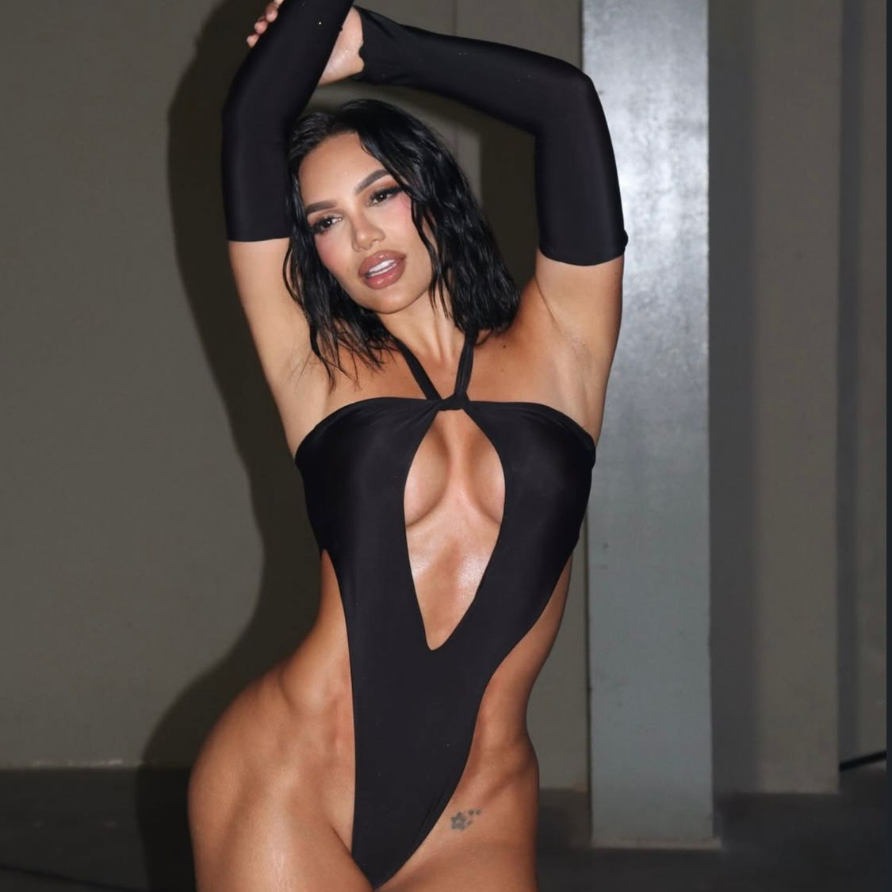

<!DOCTYPE html>
<html lang="es">
<head>
  <meta charset="UTF-8">
  <meta name="viewport" content="width=device-width, initial-scale=1.0">
  <title>La Casa de los Famosos Colombia 2026</title>
  <link rel="preconnect" href="https://fonts.googleapis.com">
  <link rel="preconnect" href="https://fonts.gstatic.com" crossorigin>
    <link href="https://fonts.googleapis.com/css2?family=Merriweather:wght@700&family=Poppins:wght@400;600&family=Dancing+Script:wght@700&display=swap" rel="stylesheet">

  <link rel="stylesheet" href="style.css">
</head>
<body>

    <header>
    <nav>
      <h1>La Casa de los Famosos 2026</h1>
      <ul>
        <li><a href="#inicio">Inicio</a></li>
        <li><a href="#contenedores-aspirantes">Aspirantes</a></li>
        <li><a href="#contacto">Contacto</a></li>
      </ul>
    </nav>
  </header>

    <section id="inicio" class="inicio">
    <h2>La Casa de los Famosos Colombia 2026</h2>
    

      El reality más polémico, divertido y esperado del año se prepara para una nueva edición. 
      Amor, chismes, traiciones y momentos inolvidables están por llegar.  
      Aquí conocerás a los posibles aspirantes que podrían entrar a la casa más famosa del país.
    

    

      <video autoplay muted loop controls class="trailer">
        <source src="VIDEOS/videoplayback.mp4" type="video/mp4">
        Lo sentimos, tu navegador no reproduce este video.
      </video>
    

  </section>

    <section id="contenedores-aspirantes" class="contenedores-interactivos">
    
        

      

        <h3>Mujeres Aspirantes</h3>
      

      

        <h3>Hombres Aspirantes</h3>
      

      

        <h3>Sobre Nosotros</h3>
      

    

        

        

                    

            
            <h3>La Barbi Colombiana</h3>
            

              <a href="https://www.tiktok.com/@labarbiecolombianaofi?_t=ZS-90Q5r8DNZuJ&_r=1">TikTok</a>
              <a href="https://www.instagram.com/labarbiecolombianaoficial?igsh=aHM0YnpsZ3BteHBh">Instagram</a>
            

            <button onclick="descargarImagen('IMAGENES/barbi.jpeg', 'la-barbi-colombiana')">Descargar</button>
          

          

            
            <h3>Juliana Calderón</h3>
            

              <a href="https://www.tiktok.com/@julicalderon12?_t=ZS-90Q5svwlZtX&_r=1">TikTok</a>
              <a href="https://www.instagram.com/julianacalderon12?igsh=c2xxZ2NidXJ3eHU2">Instagram</a>
            

            <button onclick="descargarImagen('IMAGENES/juliana.jpeg', 'juliana-calderon')">Descargar</button>
          

          

            
            <h3>Karol Alcendra</h3>
            

              <a href="https://www.tiktok.com/@karolalcendrat?_t=ZS-90Q5zXUFtsF&_r=1">TikTok</a>
              <a href="https://www.instagram.com/karolalcendra_?igsh=MXRldG1wbnQybjJocA==">Instagram</a>
            

            <button onclick="descargarImagen('IMAGENES/karola.jpeg', 'karol-alcendra')">Descargar</button>
          

          

            
            <h3>Luna Gil</h3>
            

              <a href="https://www.tiktok.com/@luna.gil?_t=ZS-90Q61gLfmx0&_r=1">TikTok</a>
              <a href="https://www.instagram.com/luna.gilreal?igsh=MTVzbWdzcWZzY3A2OQ==">Instagram</a>
            

            <button onclick="descargarImagen('IMAGENES/lunagil.jpeg', 'luna-gil')">Descargar</button>
          

          

            
            <h3>Manuela Goméz</h3>
            

              <a href="https://www.tiktok.com/@manuelagomezfranco?_t=ZS-90Q6DjZIGEa&_r=1">TikTok</a>
              <a href="https://www.instagram.com/manugomezfranco1?igsh=M3dxMDE3a3RvdWpi">Instagram</a>
            

            <button onclick="descargarImagen('IMAGENES/manuela.jpeg', 'manuela-gomez')">Descargar</button>
          

                    

            
            <h3>Mariana Zapata</h3>
            

              <a href="https://www.tiktok.com/@mariana.zapata13?_t=ZS-90Q6Ee3BGtU&_r=1">TikTok</a>
              <a href="https://www.instagram.com/mariana.zapata13?igsh=YXlqand2Nzd3ejE4">Instagram</a>
            

            <button onclick="descargarImagen('IMAGENES/mariana.jpeg', 'mariana-zapata')">Descargar</button>
          

          

            
            <h3>Maria Alejandra Villegas "Mav" </h3>
            

              <a href="https://www.tiktok.com/@priv_mav?_t=ZS-90Q6IQWi3fu&_r=1">TikTok</a>
              <a href="https://www.instagram.com/oficial_mav?igsh=dGg5bDNidHpwYm16">Instagram</a>
            

            <button onclick="descargarImagen('IMAGENES/mav.jpeg', 'mav')">Descargar</button>
          

          

            
            <h3>Samantha Correa</h3>
            

              <a href="https://www.tiktok.com/@samcorreat?_t=ZS-90Q6JirkrPG&_r=1">TikTok</a>
              <a href="https://www.instagram.com/samcorreat?igsh=bTd1Y2ZnYm1hZmFk">Instagram</a>
            

            <button onclick="descargarImagen('IMAGENES/samantha.jpeg', 'samantha-correa')">Descargar</button>
          

          

            
            <h3>Marcela Reyes</h3>
            

              <a href="https://www.tiktok.com/@marce_50?_t=ZS-90Q6Ol6Bw40&_r=1">TikTok</a>
              <a href="https://www.instagram.com/marcelareyes?igsh=b2ZmZXFoNXdhcHYy">Instagram</a>
            

            <button onclick="descargarImagen('IMAGENES/marcela.jpeg', 'marcela-reyes')">Descargar</button>
          

          

            
            <h3>Andrea valdiri</h3>
            

              <a href="https://www.tiktok.com/@andreavaldirisos1?_t=ZS-90Q6OiwFoNG&_r=1">TikTok</a>
              <a href="https://www.instagram.com/andreavaldirisos?igsh=MTd6OHl6dWJyYWYwZA==">Instagram</a>
            

            <button onclick="descargarImagen('IMAGENES/valdiri.jpeg', 'andrea-valdiri')">Descargar</button>
          

                  

    

        

        

                    

            
            <h3>Valentino Lazaro</h3>
            

              <a href="https://www.tiktok.com/@valentinolazaroh_?_t=ZS-90Q7JyfW8RD&_r=1">TikTok</a>
              <a href="https://www.instagram.com/valentinolazaroh?igsh=MTdwYmN5em1uOWplcw==">Instagram</a>
            

            <button onclick="descargarImagen('IMAGENES/valentino.jpeg', 'valentino-lazaro')">Descargar</button>
          

          

            
            <h3>Javier Cardona</h3>
            

              <a href="https://www.tiktok.com/@javiercardonat1?_t=ZS-90Q7S3hTm5f&_r=1">TikTok</a>
              <a href="https://www.instagram.com/javiercardonat?igsh=MWJ4ZGZ0M2t0Zmd1">Instagram</a>
            

            <button onclick="descargarImagen('IMAGENES/javier.jpeg', 'javier-cardona')">Descargar</button>
            

          

            
            <h3>Mateo Carvajal</h3>
            

              <a href="https://www.tiktok.com/@mateoc17_?_t=ZS-90Q7TVQS7YG&_r=1">TikTok</a>
              <a href="https://www.instagram.com/mateoc17?igsh=Z3ByMXp6MHdhZ241">Instagram</a>
            

            <button onclick="descargarImagen('IMAGENES/mateo.jpeg', 'mateo-carvajal')">Descargar</button>
          

          

            
            <h3>Matias Ochoa</h3>
            

              <a href="https://www.tiktok.com/@matiasochoa022?_t=ZS-90Q7Z3SYgFu&_r=1">TikTok</a>
              <a href="https://www.instagram.com/matiasochoa02?igsh=MXc5eWlwaGkxMmR2aQ==">Instagram</a>
            

            <button onclick="descargarImagen('IMAGENES/matias.jpeg', 'matias-ochoa')">Descargar</button>
          

          

            
            <h3>Omi Camacho</h3>
            

              <a href="https://www.tiktok.com/@omicamacho?_t=ZS-90Q7f7Ic7LG&_r=1">TikTok</a>
              <a href="https://www.instagram.com/omi_camacho?igsh=MTRzOG5sOWR0aHVscA==">Instagram</a>
            

            <button onclick="descargarImagen('IMAGENES/omi.jpeg', 'omi-camacho')">Descargar</button>
          

                    

            
            <h3>Adrian Diaz "La Natacha"</h3>
            

              <a href="https://www.tiktok.com/@lanatacha69?_t=ZS-90Q7hGagElz&_r=1">TikTok</a>
              <a href="https://www.instagram.com/la_natacha69?igsh=MWVxbmh2ejN2d3ByeA==">Instagram</a>
            

            <button onclick="descargarImagen('IMAGENES/natacha.jpeg', 'adrian-diaz-natacha')">Descargar</button>
          

          

            
            <h3>Javier Gomez "El Javi"</h3>
            

              <a href="https://www.tiktok.com/@javiergomezm_?_t=ZS-90Q7ioIwFgF&_r=1">TikTok</a>
              <a href="https://www.instagram.com/javiergomezm_?igsh=djlnam0ybmkydHo3">Instagram</a>
            

            <button onclick="descargarImagen('IMAGENES/javi.jpeg', 'javier-gomez')">Descargar</button>
          

          

            
            <h3>Felipe Saruma</h3>
            

              <a href="https://www.tiktok.com/@sarumaoficial?_t=ZS-90Q7o6TUNN4&_r=1">TikTok</a>
              <a href="https://www.instagram.com/felipesaruma?igsh=NDVsbHFlcGx2aHlh">Instagram</a>
            

            <button onclick="descargarImagen('IMAGENES/felipe.jpeg', 'felipe-saruma')">Descargar</button>
          

          

            
            <h3>Daniel Patiño "Paisa Vlogs"</h3>
            

              <a href="https://www.tiktok.com/@paisa?_t=ZS-90Q7p7riI5v&_r=1">TikTok</a>
              <a href="https://www.instagram.com/paisa?igsh=ZjZneDhkYWwzcXRl">Instagram</a>
            

            <button onclick="descargarImagen('IMAGENES/paisa.jpeg', 'daniel-patino-paisa')">Descargar</button>
          

          

            
            <h3>Ricardo Florez "La Ricarda"</h3>
            

              <a href="https://www.tiktok.com/@laricardaoficial_?_t=ZS-90Q7tChD1b6&_r=1">TikTok</a>
              <a href="https://www.instagram.com/laricardaoficial?igsh=ZW15cHJ0c2RvbWFj">Instagram</a>
            

            <button onclick="descargarImagen('IMAGENES/ricardo.jpeg', 'ricardo-florez-ricarda')">Descargar</button>
          

                  

    

        

      <h2>Sobre Nosotros: Tercera Temporada 2026</h2>
      

        ¡Esta es la TERCERA TEMPORADA de nuestro exitoso reality show colombiano!
        LA CASA DE LOS FAMOSOS COLOMBIA regresa con más sorpresas, desafíos inesperados y, por supuesto,
        la convivencia de las personalidades más influyentes y polémicas del país.
      

      

        ¿DE QUE TRATA?: Un grupo de celebridades es encerrado en una casa sin contacto con el exterior,
        donde sus vidas son grabadas 24/7. El público decide quién se queda y quién se va, llevando a un solo
        ganador el gran premio. ¡Prepárate para drama, alianzas inesperadas y mucha diversión!
      

    

  </section>

    <footer id="contacto">
    <h2>¡Sé parte de la nueva temporada!</h2>
    

            <a href="http://wa.me/573054395826" target="_blank">
        ENVIAR MENSAJE POR WHATSAPP PARA TU POSTULACIÓN
      </a>
    

    <h2>Síguenos en nuestras redes</h2>
    

      <a href="https://www.tiktok.com/@lacasadelosfamososco?_t=ZS-90Q7veMescS&_r=1" target="_blank">TikTok Oficial</a>
      <a href="https://www.instagram.com/lacasadelosfamososcolombia1?igsh=MWU3YTdpaG54NDdhaQ==" target="_blank">Instagram Oficial</a>
    

    
© 2026 La Casa de los Famosos Colombia | Página creada por Alexander Murillo

  </footer>

    

</body>
</html>

/* ESTILOS BASE Y FONDO DE PÁGINA */
html {
scroll-behavior: smooth;
}

body {
margin: 0;
font-family: 'Poppins', sans-serif;
/* REEMPLAZA 'IMAGENES/fondo_reality.jpg' con la ruta correcta */
background-image: url('IMAGENES/fondo_reality.jpg'); 
background-size: cover; 
background-attachment: fixed; 
background-color: #0d0d0d;
color: #ffffff; 
}

/* NAVBAR Y PRESENTACIÓN */
.inicio {
background: rgba(255, 255, 255, 0.9); 
color: #111;
text-align: center;
padding: 60px 10%;
}

header {
background: linear-gradient(90deg, #6a00f4, #ff8c00);
color: white;
padding: 10px 0;
position: sticky;
top: 0;
z-index: 100;
}

nav {
display: flex;
justify-content: space-between;
align-items: center;
width: 90%;
margin: auto;
}

nav h1 {
font-size: 1.5em;
}

nav ul {
list-style: none;
display: flex;
gap: 20px;
}

nav a {
color: white;
text-decoration: none;
font-weight: 600;
}

nav a:hover {
text-decoration: underline;
}

.inicio h2 {
font-size: 4em;
color: #0004f4;
}

.inicio p {
font-size: 1.5em;
max-width: 800px;
margin: 20px auto;
}

.trailer {
width: 70%;
margin-top: 30px;
border-radius: 10px;
box-shadow: 0 4px 20px rgba(0,0,0,0.4);
}

/* RECTÁNGULOS INTERACTIVOS (ASPIRANTES / NOSOTROS) */
.contenedores-interactivos {
padding: 60px 5%;
color: #fff; 
}

.selectores {
display: flex;
justify-content: center;
gap: 20px;
margin-bottom: 40px;
}

.selector {
 background-color: rgba(255, 255, 255, 0.2); 
 border: 2px solid #ff8c00;
 border-radius: 10px;
 padding: 20px 30px;
 text-align: center;
 cursor: pointer;
 transition: background-color 0.3s, border-color 0.3s, transform 0.1s;
 width: 30%;
 max-width: 300px;
}

.selector:hover {
 background-color: rgba(255, 255, 255, 0.3);
 transform: translateY(-3px);
}

.selector.active {
 background: linear-gradient(45deg, #6a00f4, #ff8c00); 
 border-color: #6a00f4;
 box-shadow: 0 0 15px #6a00f4;
}

.contenido-aspirantes, .contenido-nosotros {
 background-color: rgba(0, 0, 0, 0.7); 
 padding: 40px 20px;
 border-radius: 15px;
 box-shadow: 0 0 20px rgba(0, 0, 0, 0.5);
 display: none; 
 color: white;
}

.contenido-aspirantes.visible, .contenido-nosotros.visible {
 display: block; 
 animation: slideDown 0.5s ease-out;
}

@keyframes slideDown {
 from { opacity: 0; transform: translateY(-20px); }
 to { opacity: 1; transform: translateY(0); }
}

.contenido-nosotros h2 {
 font-size: 2.5em;
 text-align: center;
 margin-bottom: 20px;
}

.contenido-nosotros p {
 font-size: 1.1em;
 line-height: 1.6;
 margin: 15px auto;
 max-width: 900px;
 text-align: center;
}

/* TARJETAS (CARDS) Y BOTÓN DESCARGAR */
.cards {
 display: flex;
 justify-content: center;
 flex-wrap: wrap;
 gap: 25px;
 margin-top: 30px;
row-gap: 50px;
}

.card {
 background-color: #f9f9f9;
 border-radius: 15px;
 box-shadow: 0 4px 10px rgba(0,0,0,0.5);
 width: 220px;
 transition: transform 0.3s, box-shadow 0.3s;
 overflow: hidden;
 animation: fadeIn 1s ease;
 color: #111; 
 padding-bottom: 10px;
}

@keyframes fadeIn {
 from {opacity: 0; transform: translateY(20px);}
 to {opacity: 1; transform: translateY(0);}
}

.card:hover {
 transform: translateY(-5px);
 box-shadow: 0 8px 20px rgba(0,0,0,0.2);
}

.card img {
 width: 100%;
 height: 250px;
 object-fit: cover;
}

.card h3 {
 height: 50px; 
 display: flex;
 justify-content: center;
 align-items: center; 
 text-align: center; 
 margin: 0;
}

.redes {
 text-align: center;
}

.redes a {
 display: inline-block;
 margin: 5px;
 padding: 8px 12px;
 border-radius: 5px;
 text-decoration: none;
 color: white;
 font-weight: bold;
}

.redes a:first-child {
 background-color: #ff0050; 
}

.redes a:last-child {
 background-color: #833AB4; 
}

.card button { 
 display: block;
 width: 90%;
 margin: 10px auto 0;
 padding: 10px;
 background-color: #00aaff;
 color: white;
 border: none;
 border-radius: 5px;
 cursor: pointer;
 font-weight: bold;
 transition: background-color 0.3s;
}

.card button:hover {
 background-color: #0088cc;
}

/* FOOTER Y WHATSAPP */
footer {
 background: #000;
 color: #fff;
 text-align: center;
 padding: 40px 10%;
}

.whatsapp-postulacion {
 margin: 20px auto 30px;
 padding: 15px;
 background-color: #25D366; 
 border-radius: 8px;
 display: inline-block;
 box-shadow: 0 4px 10px rgba(0, 0, 0, 0.3);
}

.whatsapp-postulacion a {
 color: white;
 text-decoration: none;
 font-weight: bold;
 font-size: 1.2em;
 display: flex;
 align-items: center;
 gap: 10px;
}

.whatsapp-postulacion a::before {
 content: "📱"; 
 font-size: 1.4em;
}

.redes-oficiales a {
 display: inline-block;
 margin: 8px;
 padding: 8px 14px;
 background: linear-gradient(90deg, #6a00f4, #ff8c00);
 border-radius: 5px;
 text-decoration: none;
 color: white;
 font-weight: 600;
}

</body>
</html>
